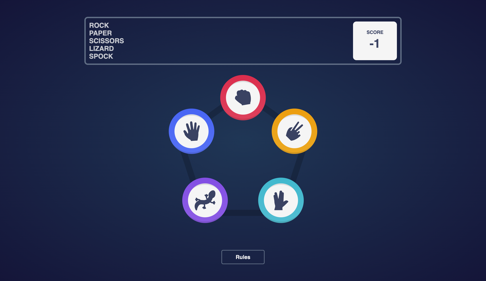

# Rock Paper Scissors Lizard Spock

Rock Paper Scissors Lizard Spock is a React application that allows users to play the popular game "Rock, Paper, Scissors, Lizard, Spock" against the computer. The game follows the rules of the classic game but adds two additional options, Lizard and Spock, increasing the number of possible outcomes.

## Overview

This project is a simple yet engaging implementation of the "Rock, Paper, Scissors, Lizard, Spock" game. Users can choose their move (Rock, Paper, Scissors, Lizard, or Spock) by clicking on the corresponding icon, and the computer randomly selects its move. The winner is determined based on the game's rules, and the user's score is updated accordingly.

## Screenshots

## Live Demo

You can play the game live at the following link:

[Play Rock Paper Scissors Lizard Spock](https://rockk-paperr-scissorss-lizardd-spockk.netlify.app)

## Features

- **Interactive Gameplay**: Users can click on icons to select their move and play against the computer.
- **Randomized Computer Move**: The computer's move is randomly generated for each game.
- **Score Tracking**: The user's score is displayed and updated based on game outcomes.
- **Responsive Design**: The application is designed to work seamlessly on various devices and screen sizes.

## Tech Stack

- React: Used for building the user interface and managing component-based architecture.
- CSS (with SASS): Styled components to enhance the visual appeal and layout of the application.
- JavaScript (ES6+): Implemented game logic and interactivity using modern JavaScript features.
- GitHub Pages: Hosting platform for deploying the live demo of the application
